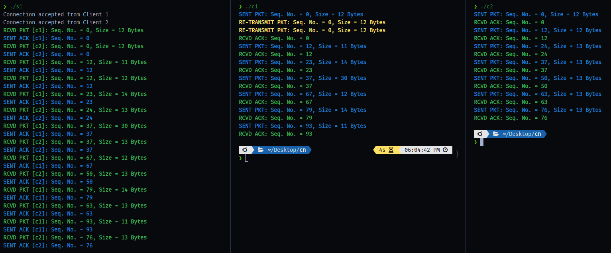

# CS F303: Computer Networks - Take Home Assignment

Write client-server  programs  to  upload  one  file  from  each  client,  `c1`  and  `c2`,  to  a server,  `s1`.  Client  `c1`  sends a  file  `name.txt`,  and  client `c2` sends  a  file  `id.txt` simultaneously  to  the  server using  stop-and-wait  ARQ  protocol  over  unreliable  channels,  which  can  drop  the  packets  (Data  and Acknowledgments)  but  does  not  corrupt  the  packets.  The  clients  `c1`  and  `c2`  make  two  separate  TCP connections to the server. The server should receive the packets alternatively from the clients' `c1` and `c2` and write them into a file `list.txt`. (Protocol is the same as Q.2 of the mid-semester exam.)

## Implementation details: 
### 1.  Packetization:  
The  `name.txt`  comprises  student  names  separated  by  a  comma.  Client  `c1`  sends  one student name at a time in a packet using stop-and-wait protocol by encapsulating it in the form of a packet structure. Similarly, `id.txt` comprises student ids corresponding to the student's names in the `name.txt`, separated  by  a  comma.  Client  `c2`  sends  one  id  at  a  time  in  a  packet  using  stop-and-wait  protocol  by 
encapsulating it  as a packet  structure. A  full-stop (.) character terminates  the  files `name.txt` and `id.txt`. 
Remember, c1 and c2 are independent and send packets to s1 without any coordination between them. 
`
> Note: Create `name.txt` and `id.txt` files and add a few names and ids in the specified format to test your 
programs. However, we will use our files for evaluation purposes with a similar format. 

### 2. Packet Structure (Same for c1 and c2): 
Besides the payload, the packet structure should contain the 
following information in the form of header fields.  
- The `size` (number of bytes) of the payload  
- The `seq_no` (byte sequence number) specifies the offset of the first byte of a packet to the file. 
The  character  comma  (`,`)  is  used  as  a  delimiter  between  student  names  and  ids,  hence  do  not 
count it for offset calculation.  
- Use one Byte field `TYPE` to differentiate between DATA or ACK packets. (Note: The seq_no field 
in  the  ACK  packet  would correspond  to  the DATA  packet  with the same  seq_no  value  received 
from the client. 

> Note: You can use any other header field(s) required to implement the desired functionality. Provide a  brief justification for that within the code file as a comment. 

### 3.  Random Packet Drop
To  simulate  the  erroneous  channel  (described  above),  the  server  randomly  drops  a  received  packet 
with  probability  `PDR`  and  does  not  send  `ACK`  back  to  the  client.  Keep  the  value  of  PDR  at  10%.  While 
evaluating, we may test your program's working for different PDR values.  

### 4. Retransmission Timeout
Keep the retransmission timeout duration at the client as two seconds. Keep a copy of the transmitted packet to facilitate retransmission instead of reconstructing a new packet from the input file again.  
 
### 5. Buffering
Server `s1` is not allowed to buffer any out-of-order packet. For example, `s1` is waiting for a packet from 
`c1`, and before it receives a packet from `c2`, `s1` should discard the  packet received from `c2`. Similarly, `s1`
should discard an out-of-order packet received from the same client.   

### 6. Write to File
The server first writes the student name received from client `c1` and then the corresponding student id 
received from client `c2` to the file `list.txt`. The `list.txt` format is as follows:  
> Archit Nigam,2021a7ps0089,Dharma Teja, 2020phxf0042

### 7. Output Format
The client and server programs should produce the output in the following format: (The output format is the same for `c1` to `s1` and `c2` to `s1` communication.)  

> Note:  If  you  have  used  any  additional  packet  header  field,  you  can  add  that  to  the  client  and  server 
output for better clarity. 
                       
Key functionalities to be implemented by you are as follows: 
- Input file reading, creating packets, and sending them over TCP sockets by c1 and c2. 
- Receiving packets by s1 alternatively from c1 and c2. 
- Writing the data received from c1 and c2 to the file list.txt by s1. 
- Output format at c1, c2, and s1, as discussed above. 
- Packet drop simulation and retransmission of dropped packets.